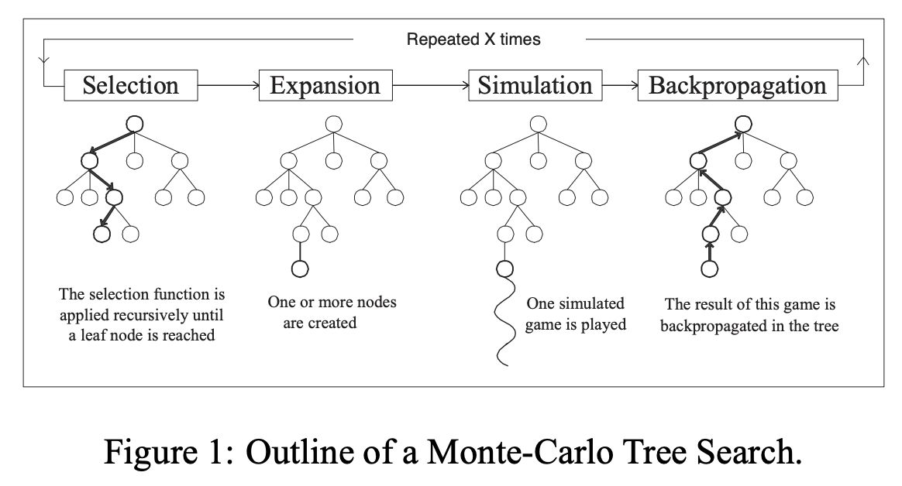

# Chess
## Project Description
Implemented classicial chess (Board Game For Two Players) using C++. The main purpose of this project is to practice advanced object oriented programming techniques such as inheritance and polymorphism.

## Display
- Terminal text based display using standard C++ <iostream> operation
- Capital letter denote white pieces
- Lower case letter denote black pieces

## Command Interpreter
- Player interact with with the system using text-based commands
- The program will analyze the correctness of the input and perform operations accordingly
- See [chess.pdf](https://github.com/MarkQi2002/Chess/blob/main/chess.pdf) for more details

## Inheritance And Polymorphism
- All six types of pieces are inherited from [piece class](https://github.com/MarkQi2002/Chess/blob/main/piece.h)
### The six types of pieces are the following
- [King](https://github.com/MarkQi2002/Chess/blob/main/king.h)
- [Queen](https://github.com/MarkQi2002/Chess/blob/main/queen.h)
- [Bishop](https://github.com/MarkQi2002/Chess/blob/main/bishop.h)
- [Rook](https://github.com/MarkQi2002/Chess/blob/main/rook.h)
- [Knight](https://github.com/MarkQi2002/Chess/blob/main/knight.h)
- [Pawn](https://github.com/MarkQi2002/Chess/blob/main/pawn.h)

- Since all six types of pieces are inherited from [piece class](https://github.com/MarkQi2002/Chess/blob/main/piece.h), we can apply polymorphism on them using the same operations

## Aritificial Intelligence
- Monte Carlo Tree Search Algorithm For Reinforcement Learning
- A tree search algorithm that can efficiently explore possible outcome of certain action in a min-max game and expand the search space to generate an sub-optimal action for the AI to take by going through the four stages of selection, expansion, simulation and back-propagation.

   

### Comment By Mark Qi (Jan 7th, 2022)
The input is currently taken from the testOne.txt or testTwo.txt
